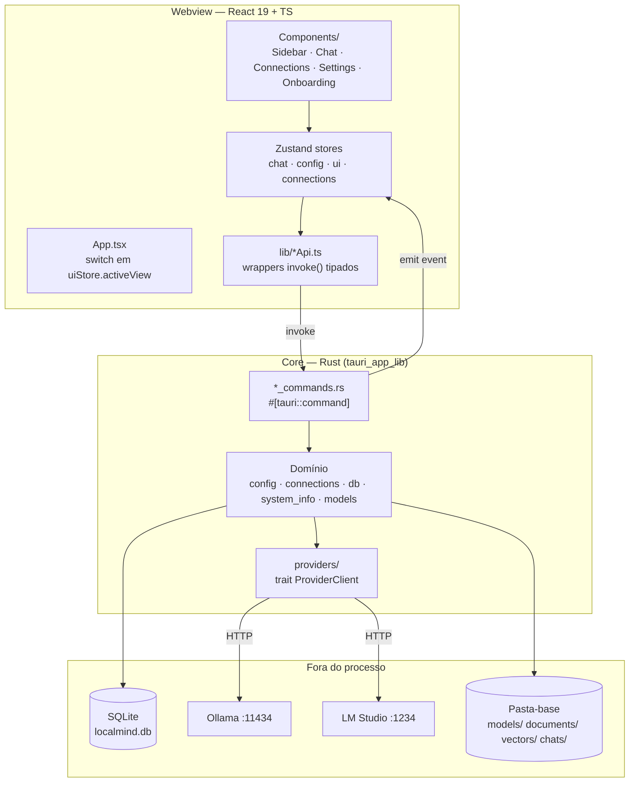

# Architecture

**Pattern:** Monolito desktop de duas camadas — webview React (apresentação) sobre um core Rust (domínio + I/O), acopladas apenas por comandos Tauri e eventos. Não há servidor, rede externa obrigatória, nem processo separado (ainda — o sidecar llama.cpp do M7 será o primeiro).

## High-Level Structure

## Identified Patterns

### Comando Tauri como única fronteira

**Location:** `src-tauri/src/*_commands.rs` → registrados em `lib.rs` `invoke_handler![]`
**Purpose:** O frontend nunca toca SQL, filesystem ou HTTP — só chama comandos.
**Implementation:** Cada comando recebe `State<DbState>` e/ou `AppHandle`, valida, delega pro domínio, devolve `Result<T, String>` (erro sempre `String`, nunca tipo customizado).
**Example:** `connection_commands::list_connections` → `connections::list_connections(sql)` + `ConnectionManager::refresh_status`.

### `DbState` = `Mutex<Option<Connection>>`

**Location:** `src-tauri/src/db.rs:5`
**Purpose:** O banco só existe **depois** que o usuário escolhe a pasta-base no wizard (AD-011). `None` = ainda não configurado.
**Implementation:** Todo comando que precisa do banco chama um helper local `require_conn(&guard)` que converte `None` num erro amigável. Esse helper está **duplicado** em 3 arquivos (ver CONCERNS.md).
**Example:** `commands.rs:8`, `connection_commands.rs:7`, `model_commands.rs:11`.

### Schema como string única idempotente

**Location:** `src-tauri/src/db.rs` (`const SCHEMA`)
**Purpose:** "Migração" é só um `execute_batch` de `CREATE TABLE IF NOT EXISTS` rodado em todo `db::open()`.
**Implementation:** Adicionar tabela = concatenar no `SCHEMA`. Não há versionamento nem migração destrutiva — funciona porque o projeto é greenfield e nenhuma tabela mudou de forma ainda (ver CONCERNS.md).

### `ProviderClient` — abstração de runtime de LLM

**Location:** `src-tauri/src/providers/mod.rs`
**Purpose:** Isolar as diferenças de API entre runtimes atrás de 4 métodos (`health_check`, `list_installed_models`, `pull_model`, `configure_model`).
**Implementation:** `#[async_trait]` para ser dyn-compatible; `ConnectionManager::provider_for(&conn)` faz o dispatch por `conn.provider` e devolve `Box<dyn ProviderClient>`. Diferenças reais entre provedores são **reportadas**, não escondidas: `ConfigApplied { requires_reload, note }` conta ao usuário o que o provedor realmente aceitou.
**Example:** `providers/{ollama,lmstudio,custom}.rs` — três impls, zero `if provider == ...` espalhado pelo resto do código.

### Progresso longo via evento, não polling

**Location:** `model_commands::pull_model` → `app.emit("model-download-progress", …)`
**Purpose:** Operações longas (download de modelo) empurram progresso pro frontend.
**Implementation:** O comando cria um `tokio::sync::mpsc::channel`, passa o `Sender` pro provider, e sobe uma task (`tauri::async_runtime::spawn`) que drena o `Receiver` e re-emite cada item como evento Tauri. O frontend escuta com `listen()` no escopo do módulo do store.
**Example:** `connectionsStore.ts` (bottom) — `listen<ModelDownloadProgressEvent>(...)` indexando progresso por `${connectionId}:${identifier}`.

### Nav + painel de tela cheia (AD-014)

**Location:** `src/store/uiStore.ts` + `App.tsx` + `components/Sidebar/*Section.tsx`
**Purpose:** Cada área da sidebar é só um botão de navegação; o conteúdo abre num painel à direita que substitui o `ChatPanel`.
**Implementation:** `uiStore.activeView: "chat" | "settings" | "connections"`; `App.tsx` faz um ternário aninhado. Sem react-router.
**Example:** `SettingsSection.tsx` é o template canônico; `ConnectionsSection.tsx` foi feito copiando ele.

### Store Zustand por domínio

**Location:** `src/store/*.ts`
**Purpose:** Estado + ações no mesmo objeto, sem reducers/actions separados.
**Implementation:** `create<State>((set, get) => ({ …dados, …ações }))`. Toda ação assíncrona segue o mesmo shape: `try { await api…; set({…}) } catch (err) { set({ error: String(err) }) }`. Erro é sempre `string | null` no store.

## Data Flow

### Boot / onboarding

1. `App.tsx` monta → `configStore.loadConfig()` → `invoke("get_app_config")`
2. Backend lê `config.json` do `app_config_dir` (**não** da pasta-base — AD-012, resolve o ovo-e-galinha de "onde está a pasta-base?")
3. Sem config ou `onboarding_completed: false` → `status: "needs-onboarding"` → renderiza `Wizard`
4. Wizard chama `complete_onboarding(basePath, theme, language)` → backend cria as 4 subpastas, abre/cria o `localmind.db`, popula `DbState`, salva o `config.json`
5. `status: "ready"` → renderiza `Sidebar` + painel. **Só a partir daqui** qualquer comando que precise do banco é chamado.

### Detecção de conexões (M3)

1. `ConnectionsSection` monta → `connectionsStore.loadConnections()` → `invoke("list_connections")`
2. Backend: lista o que está no SQLite; para cada candidato conhecido (Ollama `:11434`, LM Studio `:1234`) que ainda não existe na tabela, insere **desabilitado**
3. Para cada conexão, faz `health_check()` HTTP (timeout 5s) e devolve o `status` calculado em runtime — `status` **não** é persistido, só `enabled`
4. Frontend renderiza status por cor de bolinha

### Download de modelo (M3)

1. `ModelsList` → `pullModel(connectionId, identifier)` → `invoke("pull_model")`
2. Backend resolve a conexão, monta o `ProviderClient`, cria o canal mpsc
3. Ollama: NDJSON streamado linha a linha; LM Studio: cria job e faz polling de status a cada 750ms — **mesma interface `PullProgress` pros dois**
4. Cada item vira evento `model-download-progress`; o store atualiza `downloadProgress[key]`; o card re-renderiza a barra

## Code Organization

**Approach:** Híbrido — backend por **camada** (comandos / domínio / providers), frontend por **área funcional** (`components/Connections/`, `components/Chat/`).

**Module boundaries:**
- `src/types.ts` é o contrato compartilhado: toda struct Rust com `#[derive(Serialize)]` que cruza a fronteira tem uma `interface` espelhada lá. **Não há geração automática** — o espelhamento é manual (ver CONCERNS.md).
- `providers/` só conhece HTTP e o trait; não conhece SQLite nem Tauri.
- `*_commands.rs` conhece tudo, mas não implementa nada.
