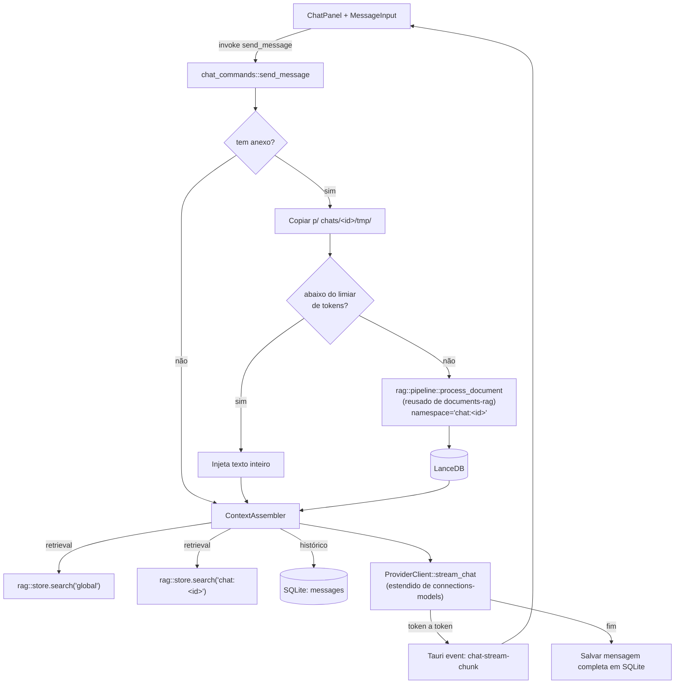

# Chat: Envio, Streaming & Anexos Design

**Spec**: `.specs/features/chat-messaging/spec.md`
**Status**: Draft

---

## Architecture Overview

O envio de mensagem dispara um comando Tauri que roda em background; os tokens da resposta chegam ao frontend via **evento** (`chat-stream-chunk`), não como retorno do comando — é o mesmo padrão de progresso assíncrono já estabelecido em `connections-models` (download) e `documents-rag` (indexação), mantendo consistência entre as três features. Anexos reusam o pipeline `parse→chunk→embed→store` de `documents-rag` inteiro, só trocando o namespace do vetor para `"chat:<chat_id>"`, o que já garante o isolamento entre chats (CHAT-11) sem código novo de isolamento.



---

## Code Reuse Analysis

### Existing Components to Leverage

| Component | Location | How to Use |
| --- | --- | --- |
| `messages` table + `list_messages` | `src-tauri/src/db.rs`, `commands.rs` (M1) | Reusa a tabela existente; adiciona `create_message` (novo — M1 só tinha leitura) |
| `rag::pipeline::process_document` | `src-tauri/src/rag/pipeline.rs` (documents-rag) | Chamado com `namespace = format!("chat:{chat_id}")` em vez de `"global"` — zero duplicação |
| `rag::store::VectorStore` | `src-tauri/src/rag/store.rs` (documents-rag) | `search()` chamado duas vezes (namespace global + namespace do chat), resultados combinados aqui |
| `ProviderClient` trait | `src-tauri/src/providers/mod.rs` (connections-models) | **Estendido** com `stream_chat` (ver Tech Decisions) — amendment documentado, não reescrita |
| `model_configs` | connections-models | Fonte do `context_length`/`gpu_offload` aplicados por chamada |
| Pasta `chats/<id>/tmp/` | AD-008, já prevista em `config::ensure_folder_structure` | Anexos são copiados pra lá; apagados junto com `delete_chat` (CHAT-12) |
| `delete_chat` | `src-tauri/src/commands.rs` (M1) | **Modificado** nesta feature para também apagar `chats/<id>/tmp/` do disco e `delete_namespace("chat:<id>")` do vetor |

### Integration Points

| System | Integration Method |
| --- | --- |
| Ollama | `POST /api/chat` com `stream: true`, `options: {num_ctx, num_gpu}` — NDJSON, uma linha por token/chunk |
| LM Studio | Antes de gerar: `POST /api/v1/models/load` com `contextLength`/`gpuOffload` **só se a config pedida for diferente da carregada atualmente** (load é caro, evita reload a cada mensagem); depois `POST /v1/chat/completions` com `stream: true` (SSE) |

---

## Components

### `ProviderClient::stream_chat` (extensão do trait de connections-models)

- **Purpose**: Adiciona ao trait já definido em `connections-models/design.md` a capacidade de streaming de chat, mantendo a mesma abstração por provedor
- **Location**: `src-tauri/src/providers/mod.rs` (mesmo arquivo, método novo no trait existente)
- **Interfaces**:
  - `async fn stream_chat(&self, model: &str, messages: Vec<ChatMessage>, context_length: Option<u32>, gpu_offload: Option<GpuOffload>) -> Result<ChatStream, ProviderError>` — `ChatStream` é um `Stream<Item = Result<ChatToken, ProviderError>>`
- **Dependencies**: `reqwest` streaming, `tokio-stream`
- **Reuses**: `ProviderClient` trait, `OllamaClient`/`LmStudioClient` (connections-models) — implementações ganham este método, não trocam de estrutura

### `chat_commands::send_message`

- **Purpose**: Endpoint principal — persiste a mensagem do usuário, processa anexos, monta contexto, dispara streaming
- **Location**: `src-tauri/src/chat_commands.rs`
- **Interfaces**:
  - `async fn send_message(app: AppHandle, db: State<DbState>, chat_id: String, content: String, attachment_paths: Vec<String>) -> Result<String, String>` — retorna o `message_id` da mensagem do usuário imediatamente; a resposta chega via eventos
  - `async fn cancel_generation(chat_id: String) -> Result<(), String>`
- **Dependencies**: `ContextAssembler`, `ProviderClient`, `CancellationRegistry`
- **Reuses**: `require_conn` (M1), `rag::pipeline` (documents-rag)

### `ContextAssembler`

- **Purpose**: Monta a lista de mensagens final enviada ao modelo, respeitando o orçamento de tokens e a prioridade (CHAT-15)
- **Location**: `src-tauri/src/chat/context_assembler.rs`
- **Interfaces**:
  - `async fn assemble(chat_id: &str, new_message: &str, use_global_rag: bool, context_length: u32) -> Vec<ChatMessage>`
- **Dependencies**: `rag::store::VectorStore`, `rag::embedding`, SQLite (`messages`)
- **Reuses**: `rag::embedding::embed_batch` (documents-rag) para embeddar a pergunta antes de buscar
- **Algoritmo de prioridade (CHAT-15)**: reserva tokens fixos pra mensagem atual; preenche o restante do orçamento nesta ordem até estourar: (1) trechos do namespace do chat (anexos), (2) histórico verbatim recente (mais novo primeiro), (3) trechos do namespace global. Categoria que estoura o orçamento é truncada, não descartada inteira (pega o que cabe).

### `CancellationRegistry`

- **Purpose**: Permite `cancel_generation` interromper um streaming em andamento
- **Location**: `src-tauri/src/chat/cancellation.rs`
- **Interfaces**:
  - `fn register(chat_id: &str) -> CancellationToken`
  - `fn cancel(chat_id: &str)`
- **Dependencies**: `tokio_util::sync::CancellationToken`, `DashMap` ou `Mutex<HashMap<...>>` gerenciado como Tauri state
- **Reuses**: nada — componente novo, pequeno e focado

### `MessageInput` (React)

- **Purpose**: Campo de texto + botão de anexo + envio; mostra status de anexo (fila/processando/pronto/erro) antes de liberar o envio visualmente
- **Location**: `src/components/Chat/MessageInput.tsx`
- **Interfaces**: usa `chatStore` (estendido) para `sendMessage(chatId, text, files)`
- **Reuses**: `configApi.pickFolder`-like padrão de diálogo nativo do Tauri, mas usando `open()` de arquivo (não pasta) — mesmo plugin `@tauri-apps/plugin-dialog` já instalado em M2

### `ChatPanel` (modificado)

- **Purpose**: Escuta eventos de streaming e renderiza tokens chegando; mostra mensagens já persistidas
- **Location**: `src/components/Chat/ChatPanel.tsx` (existente, M1 — ganha listener de evento)
- **Reuses**: componente já existe desde M1, só ganha `@tauri-apps/api/event.listen("chat-stream-chunk", ...)`

---

## Data Models

### SQLite — alterações e tabela nova

> **REVOGADO (2026-07-25, AD-021):** a coluna `chats.model_config_id` **não
> deve ser criada**. Não existe mais modelo por chat — o par ativo global
> (`get_active_pair`, feature `single-active-connection`) vale para todos os
> chats. Linha preservada abaixo apenas comentada, como histórico.

```sql
-- Alterações em `chats` (tabela existente desde M1)
-- REVOGADO por AD-021: ALTER TABLE chats ADD COLUMN model_config_id TEXT;
ALTER TABLE chats ADD COLUMN use_global_rag INTEGER NOT NULL DEFAULT 1;  -- CHAT-14

CREATE TABLE chat_attachments (
    id TEXT PRIMARY KEY,
    chat_id TEXT NOT NULL,
    message_id TEXT,                -- preenchido após a mensagem do usuário ser persistida
    filename TEXT NOT NULL,
    file_path TEXT NOT NULL,
    size_bytes INTEGER NOT NULL,
    status TEXT NOT NULL,           -- 'queued'|'parsing'|'chunking'|'embedding'|'ready'|'error'|'injected_whole'
    error_message TEXT,
    created_at TEXT NOT NULL
);
CREATE INDEX idx_chat_attachments_chat_id ON chat_attachments(chat_id);
```

```typescript
interface ChatAttachment {
  id: string;
  chat_id: string;
  message_id: string | null;
  filename: string;
  status: "queued" | "parsing" | "chunking" | "embedding" | "ready" | "error" | "injected_whole";
  error_message: string | null;
}

interface ChatStreamChunk {
  chat_id: string;
  message_id: string;   // id da mensagem do assistente sendo montada
  delta: string;
  done: boolean;
}
```

**Relationships**: `chat_attachments.chat_id` → `chats.id`; `chat_attachments.message_id` → `messages.id` (M1). ~~`chats.model_config_id` → `model_configs.id`~~ — **REVOGADO (AD-021)**: o modelo vem do par ativo global, o chat não guarda referência a modelo nenhuma.

---

## Error Handling Strategy

| Error Scenario | Handling | User Impact |
| --- | --- | --- |
| Nenhum modelo ativo (global ou do chat) | `send_message` retorna erro antes de qualquer chamada de rede | Campo de envio mostra aviso e não deixa enviar (CHAT-02) |
| Provedor cai no meio do streaming | Stream retorna erro; parcial já recebido é persistido como mensagem (marcada incompleta) | Mensagem parcial aparece + erro visível na conversa (CHAT-05) |
| Anexo falha ao processar | `chat_attachments.status = 'error'`; `send_message` segue sem aquele contexto | Aviso no chat, mensagem de texto ainda é enviada (CHAT-10) |
| Cancelamento do usuário | `CancellationToken` interrompe o stream; conteúdo acumulado até ali é persistido | Geração para, texto parcial fica salvo (CHAT-04) |
| Órfãos: app fecha com anexo "processando" | Igual à estratégia de `documents-rag` — reenfileira do zero ao reabrir | Sem estado preso |

---

## Tech Decisions (only non-obvious ones)

| Decision | Choice | Rationale |
| --- | --- | --- |
| Escopo do "modelo ativo" | **Global e único** — `get_active_pair()` (feature `single-active-connection`). ~~Por chat (`chats.model_config_id`) com fallback~~ **REVOGADO por AD-021** | Decisão do usuário: um único par (conexão, modelo) ativo no app inteiro, sem override por chat, para não haver ambiguidade sobre quem responde |
| Transporte de streaming | Evento Tauri, não retorno de comando | Comandos Tauri são request/response; streaming token-a-token precisa de push — mesmo padrão já usado em download (M3) e indexação (M5) |
| Cancelamento | `CancellationToken` por `chat_id` em state compartilhado | Simplicidade — só um streaming ativo por chat de cada vez é uma limitação aceitável no v1 |
| Anexo pequeno = inteiro no contexto | Limiar configurável (default: ~2000 tokens / ~8000 caracteres) checado ANTES do pipeline de RAG | Evita overhead de chunking/embedding para um `.txt` de 3 linhas — CHAT-09 |
| LM Studio: reload só quando config muda | Compara `context_length`/`gpu_offload` pedidos com o que já está carregado antes de chamar `/load` | Load é uma operação cara (segundos); chamar em toda mensagem degradaria a experiência |

---

## Open Questions Carried to Tasks

Nenhuma nova — as únicas incertezas técnicas desta feature (crate de parsing, modelo de embedding) já foram carregadas para as tasks de `documents-rag`, reusadas aqui.
