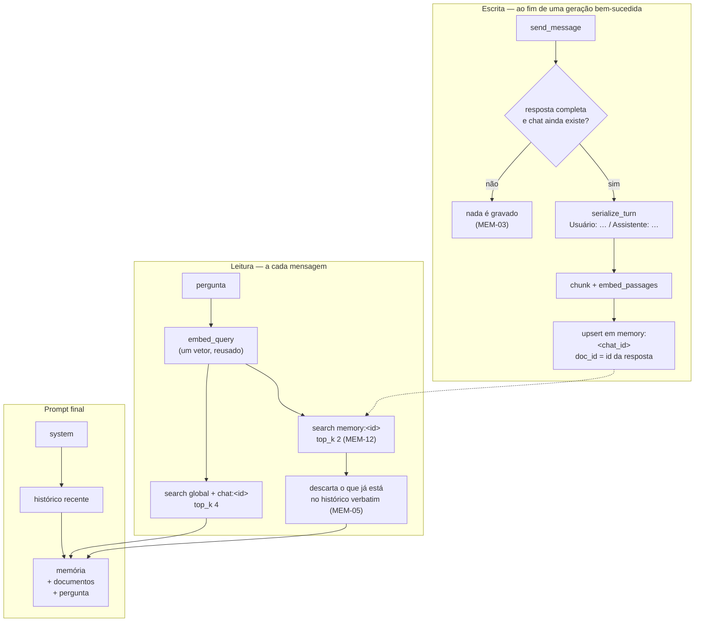

# Memória de conversa (RAG híbrido) — Design

**Spec:** `.specs/features/conversation-memory/spec.md`
**Contexto:** `.specs/features/conversation-memory/context.md`

---

## Architecture Overview

A terceira camada de RAG entra pelo mesmo caminho das outras duas — chunk → embed → LanceDB — mas
com três diferenças que o desenho precisa deixar explícitas: **quem escreve** (o fim de uma geração,
não uma importação), **de onde lê** (um namespace por conversa) e **onde entra no prompt** (depois
de tudo, e acima dos documentos).



**A ordem de consumo do orçamento muda, e é a parte não óbvia do desenho.** Hoje é: anexos inteiros →
trechos de documento → histórico recente. A memória entra **por último**, depois do histórico. Não é
detalhe de implementação: é o MEM-10, e a razão está na AD-033 — o histórico recente colado na
pergunta é o que o modelo efetivamente lê, e uma camada nova que o empurrasse para fora reintroduziria
o defeito que aquela investigação corrigiu.

---

## Code Reuse Analysis

### O que já existe e passa a ser reaproveitado

| O que | Onde | Como entra aqui |
| --- | --- | --- |
| `VectorStore::upsert` / `search` / `delete_namespace` | `rag/store.rs` | sem alteração — a memória é mais um namespace |
| `chunking::chunk_text` | `rag/chunking.rs` | fatia um turno grande demais para o modelo de embedding |
| `embedding::embed_passages` / `embed_query` | `rag/embedding.rs` | sem alteração |
| `rank_candidates` | `chat/context_assembler.rs` | o mesmo piso relativo de relevância vale para a memória |
| `use_global_rag` (coluna + comando + toggle na UI) | `chats`, `chat_commands.rs`, `ChatPanel.tsx` | molde exato do `use_memory` |
| `DocumentStatusEvent` | `rag/pipeline.rs` | molde do evento de progresso do backfill |
| `still_exists` | `rag/pipeline.rs` | mesma ideia, aplicada ao chat: uma conversa apagada no meio não deixa vetor órfão |

### Pontos de integração

- `chat_commands::send_message` — ganha a gravação no fim, condicionada a sucesso e ao toggle
- `chat/context_assembler::assemble` — ganha a recuperação de memória, depois de `fit_history`
- `commands::delete_chat` — passa a apagar dois namespaces em vez de um (MEM-09)
- `db.rs` — migração **8** (a próxima livre; a 7 foi gasta pelo M9)
- `src/types.ts` + `ChatPanel.tsx` — o toggle novo

### CONCERNS.md — o que esta feature toca

- **C-14 (`delete_chat` não cancela a geração em andamento)** — a feature **piora** o sintoma se
  ignorado: uma geração que termina depois de o chat ser apagado gravaria memória num chat que não
  existe mais, deixando vetores órfãos que nada apaga. O desenho responde com a checagem de
  existência antes do `upsert`, mesmo padrão do `still_exists` do pipeline. Não resolve o C-14 —
  apenas não constrói em cima dele.
- **C-03 (`types.ts` espelhado à mão)** — mais um campo a espelhar. Sem geração de tipos, é uma
  edição manual consciente.
- **C-04 (zero teste de frontend)** — o toggle não terá teste automatizado, como todo o resto da UI.

---

## Components

### `chat::memory` (novo — `src-tauri/src/chat/memory.rs`)

O módulo inteiro da feature. Funções puras primeiro, I/O depois:

| Função | Papel | Testável |
| --- | --- | --- |
| `memory_namespace(chat_id) -> String` | `memory:<chat_id>` — distinto de `chat:<chat_id>` (MEM-07) | sim, puro |
| `serialize_turn(question, answer) -> String` | `Usuário: …\nAssistente: …` (MEM-01) | sim, puro |
| `pair_turns(messages) -> Vec<Turn>` | reduz uma lista de mensagens aos pares completos user→assistant (MEM-17, MEM-20) | sim, puro |
| `record_turn(app, chat_id, answer_id, question, answer)` | chunk + embed + upsert | não (I/O) |
| `retrieve(store, query_vec, chat_id, exclude_ids)` | busca + dedup do histórico verbatim (MEM-04, MEM-05, MEM-08) | parcial |
| `backfill(app, chat_id)` | reindexa os pares já gravados, com progresso (MEM-17…MEM-20) | não (I/O) |

**`doc_id` de um turno é o id da mensagem do assistente.** É único, já existe, e é a chave que torna
o `upsert` idempotente de graça — ele apaga por `doc_id` antes de escrever, então gravar o mesmo par
duas vezes (gravação automática e depois backfill) produz um registro, não dois (MEM-19).

**`pair_turns` ignora mensagens sem par.** Uma pergunta sem resposta (geração cancelada) e uma
resposta órfã não viram memória — é a mesma regra do MEM-03, aplicada ao caminho do backfill.

### `chat::context_assembler` (ampliado)

Três mudanças:

1. **O vetor da pergunta é calculado uma vez** e usado nas duas buscas. Hoje `retrieve` embedda a
   pergunta internamente; a função é dividida para que a memória não pague um segundo `embed_query`
   (que é CPU e roda com o modelo carregado).
2. **`recent_history` passa a devolver o id de cada mensagem**, além de papel e conteúdo. Sem o id
   não há como cumprir o MEM-05 — a dedup compara o `doc_id` do candidato de memória com os ids que
   já estão no prompt verbatim.
3. **`question_with_context` recebe dois grupos**, com preâmbulos diferentes, na ordem
   memória → documentos → pergunta.

**Por que a memória vem acima dos documentos, e não abaixo:** a AD-033 mediu que o modelo responde ao
que está mais perto da pergunta. O documento importado é a intenção explícita do usuário; a memória é
contexto de apoio. Perto da pergunta fica o que o usuário pediu para o app usar.

**Por que preâmbulos separados:** o `CONTEXT_PREAMBLE` atual manda citar o nome do arquivo em
`[fonte: ...]`. Um turno de conversa não tem arquivo, e um modelo pequeno instruído a citar uma fonte
que não existe **inventa uma** — foi observado ao vivo respondendo `[fonte: GPT-3 informações geral]`.
O bloco de memória entra sob um preâmbulo próprio que diz o que ele é e proíbe citá-lo como arquivo
(MEM-06).

### `chat_commands` (ampliado)

- `send_message` grava o turno **depois** de persistir a resposta, em `spawn`, e só quando: houve
  texto, não houve erro, o token não foi cancelado, o toggle está ligado e o chat ainda existe
  (MEM-01, MEM-02, MEM-03).
- `set_chat_use_memory(chat_id, enabled)` — cópia de `set_chat_use_global_rag` (MEM-14, MEM-16).
- `index_chat_history(chat_id)` — dispara o backfill (MEM-17).

### Frontend

- `types.ts`: `Chat` ganha `use_memory: boolean`
- `chatApi.ts`: `setChatUseMemory`, `indexChatHistory`
- `ChatPanel.tsx`: segundo interruptor ao lado do de base global, mais o botão de indexar histórico
  com o progresso do evento
- i18n: chaves novas em EN e PT, com paridade obrigatória

---

## Data Models

### Migração 8 — `MIGRATION_8_CHAT_MEMORY`

```sql
ALTER TABLE chats ADD COLUMN use_memory INTEGER NOT NULL DEFAULT 1;
```

`DEFAULT 1` é o MEM-15 e, de quebra, resolve as conversas existentes: elas passam a ter memória
ligada, e o que faltar do histórico delas é o que o backfill resolve sob demanda.

**Não há tabela nova.** A memória vive no LanceDB, como as outras camadas; o SQLite já guarda as
mensagens, que são a fonte da verdade para o backfill.

### Namespaces do banco vetorial

| Namespace | Conteúdo | Quem lê |
| --- | --- | --- |
| `global` | documentos da base | qualquer chat com `use_global_rag` |
| `chat:<id>` | anexos daquele chat | só aquele chat |
| `memory:<id>` | turnos daquele chat | só aquele chat, e só com `use_memory` |

Três prefixos disjuntos. `memory:` não colide com `chat:` nem com `global` — o mesmo argumento que o
teste `chat_namespaces_are_prefixed_and_never_collide_with_global` já faz para os dois primeiros, e
o teste novo faz para o terceiro.

---

## Error Handling Strategy

| Falha | Comportamento | Requisito |
| --- | --- | --- |
| Embedding indisponível na gravação | o turno não é gravado; a resposta já foi entregue e persistida | MEM-02 |
| Banco vetorial quebrado na recuperação | a resposta sai sem memória, com `chat-retrieval-warning` | MEM-13 |
| Orçamento esgotado antes da memória | sai sem memória, sem aviso — é um estado normal, não uma falha | MEM-11 |
| Chat apagado durante a geração | nada é gravado (checagem de existência antes do `upsert`) | C-14 |
| Chat apagado durante o backfill | o backfill para e não grava | edge case |
| Backfill com a memória desligada | recusa nomeando o toggle | edge case |

**Regra herdada:** recuperação é acréscimo, gravação é melhor-esforço. Nenhuma das duas pode derrubar
a conversa — é a mesma postura que o `retrieval_error` já implementa para os documentos.

---

## Tech Decisions

| Decisão | Alternativa descartada | Por quê |
| --- | --- | --- |
| Namespace `memory:<id>` separado do `chat:<id>` | reusar o namespace de anexos | os dois teriam que ser desligados juntos, e o teto de recuperação seria compartilhado — a memória engoliria os anexos |
| `doc_id` = id da mensagem do assistente | UUID novo por turno | idempotência de graça no `upsert`; sem isso o backfill duplicaria tudo |
| Memória depois do histórico no orçamento | antes, junto dos documentos | AD-033: o histórico recente é o que o modelo lê; a camada nova não pode deslocá-lo |
| Desligado para de gravar também | desligar só a leitura | gastar CPU de embedding em dados que ninguém vai ler; e o backfill existe justamente como caminho de volta |
| Backfill como comando explícito | varredura no boot | recusado pelo usuário (`context.md`, decisão 2) |
| Teto próprio de **1** turno | dividir o `TOP_K` de 4 com os documentos | um teto compartilhado faz a memória competir com o documento importado, que é a intenção explícita do usuário. Era 2 no plano e caiu para 1 pela medição da Open Question #1: sem piso de relevância funcionando, o teto é o único filtro |

---

## Open Questions

1. ~~**O turno serializado é bom material de embedding?**~~ — **RESPONDIDA em 2026-07-27, medindo**
   contra o modelo real (`chat::memory::memory_quality`, `#[ignore]`, caminhos por variável de
   ambiente e sobre uma **cópia** do cache de modelos do usuário). Três respostas, e a terceira
   mudou o código:

   **(a) Sim, o turno é recuperável.** Para *"o prazo que a gente tinha acertado era de quanto
   tempo?"*, o turno sobre prazo ganha com folga: **0,2484** contra 0,3413 (índices de banco) e
   0,3805 (capital da Austrália). Nenhuma palavra da resposta guardada aparece na pergunta.

   **(b) O plano B está descartado, e por medição.** Embeddar sem os rótulos `Usuário:`/`Assistente:`
   dá **1,33×** de separação contra **1,37×** com eles — ou seja, tirar os rótulos **piora**
   levemente. Eles não custam nada; a suspeita de que aproximavam todos os turnos entre si estava
   errada.

   **(c) O piso relativo de relevância é inerte nesta camada.** Para *"como faço arroz de forno?"*,
   assunto que a conversa nunca tratou, **os 3 turnos passam o corte** (mais próximo 0,3282, corte
   0,9846). O `RELATIVE_DISTANCE_FLOOR` separa documentos porque um acerto real de passagem cai
   perto de 0,09 (AD-025 mediu 3,9×); turnos de conversa ficam todos na faixa 0,25–0,38, e a razão
   para o melhor nunca chega a 3×.

   **Consequência aplicada:** `MEMORY_TOP_K` caiu de **2 para 1**. Sem filtro que funcione, o teto
   *é* o filtro, e um turno irrelevante colado na pergunta é o mesmo modo de falha que a AD-033
   mediu — dois seriam o dobro dele. **Não inventei um limiar absoluto** a partir de três turnos
   sintéticos: essa é a decisão que a T9 deve tomar com uma conversa real.
2. **Dois turnos consecutivos quase idênticos** (o usuário reformula a mesma pergunta) produzem
   vetores quase idênticos. Com o teto em 1 o sintoma encolhe — só um deles entra —, mas a escolha
   entre os dois passa a ser arbitrária. Fica registrado; a mitigação, se aparecer, é deduplicar por
   similaridade entre os selecionados.
3. **Custo de armazenamento não foi medido.** Cada turno vira ao menos um vetor de
   `EMBEDDING_DIM` floats. Uma conversa de 200 turnos é uma ordem de grandeza acima de um PDF curto.
   A medição sai na execução, contra o `vectors/` real — número, não estimativa.
