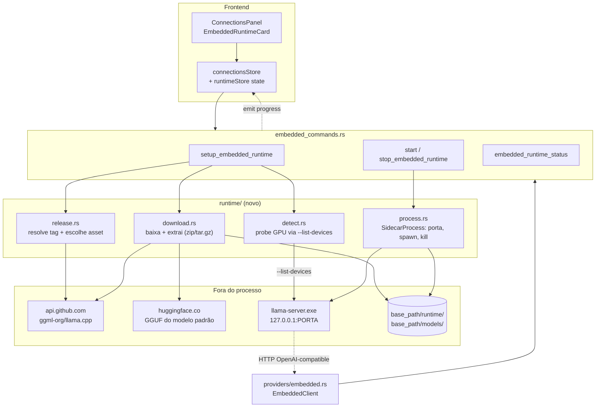

# Embedded Runtime (llama.cpp) — Design

**Spec**: `.specs/features/embedded-runtime/spec.md`
**Context**: `.specs/features/embedded-runtime/context.md`
**Depende de**: `single-active-connection` (o runtime embutido é mais uma conexão, e a regra de "uma ativa" precisa estar valendo antes)
**Status**: Draft

---

## Architecture Overview

O runtime embutido **não é um provedor novo do ponto de vista do chat** — depois de rodando, `llama-server` expõe uma API OpenAI-compatible (`/v1/chat/completions`, `/v1/models`), exatamente o que o `CustomClient` do M3 já sabe consumir. O que a feature realmente adiciona é o que acontece **antes** disso: baixar o binário certo, baixar o modelo, escolher a porta, subir o processo filho e matá-lo no fim.

Por isso o design separa em duas metades: um **`RuntimeManager`** (ciclo de vida, tudo que é novo) e um **`EmbeddedClient`** fininho que implementa `ProviderClient` delegando o grosso pro que já existe.



---

## Research Findings (verificado, não fabricado)

| Item | Resultado | Fonte |
| --- | --- | --- |
| API OpenAI-compatible | `llama-server` expõe `POST /v1/chat/completions`, `GET /v1/models`, `GET /health` (público, sem API key) | `ggml-org/llama.cpp` `tools/server/README.md` |
| Flags necessárias | `-m/--model FNAME`, `-c/--ctx-size N` (default 0 = herda do modelo), `-ngl/--n-gpu-layers N` (default auto), `--host` (default `127.0.0.1`), `--port` (default `8080`) | idem |
| Detecção de GPU | `llama-server --list-devices` **imprime os devices e sai** — ex.: `Vulkan0: NVIDIA GeForce RTX 2060 (6144 MiB, 5136 MiB free)` | idem + issue #16659 |
| Resolução de release | `GET https://api.github.com/repos/ggml-org/llama.cpp/releases/latest` → `{ tag_name, assets: [{ name, browser_download_url, size }] }`. **Confirmado ao vivo em 2026-07-25**: `tag_name` = `b10107` | chamada real à API nesta sessão |
| Nomes de asset | **Confirmados ao vivo**: `llama-b10107-bin-win-cpu-x64.zip`, `llama-b10107-bin-win-vulkan-x64.zip`, `llama-b10107-bin-ubuntu-x64.tar.gz`, `llama-b10107-bin-ubuntu-vulkan-x64.tar.gz` (também existem cuda-12.4/13.3, hip-radeon, sycl, openvino, rocm) | idem |
| Vulkan vs CUDA em 2026 | CUDA ainda ganha em prompt processing (RTX 5090: ~14.073 vs ~10.382 pp512), empata praticamente em geração de token (290 vs 264 tg128). Vulkan cobre NVIDIA/AMD/Intel e **não exige toolkit instalado** | benchmarks públicos de 2026 |
| Matar filho no exit | `RunEvent::ExitRequested` / `RunEvent::Exit` no closure de `app.run(...)` é o gancho confiável (eventos de janela não bastam) | discussões oficiais tauri-apps #3273, #10379 |

**Incerteza declarada:** o nome exato do arquivo GGUF do Phi-3.5 no repositório do bartowski (`Phi-3.5-mini-instruct-Q4_K_M.gguf`) apareceu na pesquisa, mas **não** foi confirmado por uma requisição real ao Hugging Face nesta sessão. A task T7 exige verificar a URL antes de fixá-la no código — não assumir.

---

## Code Reuse Analysis

### Existing Components to Leverage

| Component | Location | How to Use |
| --- | --- | --- |
| `ProviderClient` trait | `src-tauri/src/providers/mod.rs` | `EmbeddedClient` implementa o mesmo trait — nenhuma mudança na fronteira; o resto do app não sabe que esse provedor é especial |
| `CustomClient` | `src-tauri/src/providers/custom.rs` | Já fala `GET /v1/models` num servidor OpenAI-compatible genérico. `EmbeddedClient` **delega** listagem/health pra ele em vez de reimplementar |
| `ConnectionManager::provider_for` | `src-tauri/src/connections.rs` | Ganha o braço `"embedded" => EmbeddedClient` — mesma forma dos outros três |
| Migração versionada | `src-tauri/src/db.rs` (após `single-active-connection` T1) | Se `connections` precisar de coluna nova, entra como migração 3 — não repetir o problema do C-01 |
| Padrão de progresso por evento | `model_commands::pull_model` | O download do binário/modelo emite `embedded-setup-progress` com o mesmo formato de `PullProgress`, reusando a UI de barra que já existe |
| `ensure_folder_structure` | `src-tauri/src/config.rs` (`SUBDIRS`) | Adicionar `"runtime"` ao array — pasta do binário fica sob a pasta-base do usuário (AD-008), não em `%TEMP%` |
| `ModelDownloadCard` | `src/components/Connections/ModelDownloadCard.tsx` | Barra de progresso e estados (baixando/erro/pronto) já resolvidos visualmente |

### Integration Points

| System | Integration Method |
| --- | --- |
| GitHub Releases | HTTP GET sem auth em `api.github.com` (limite de 60 req/h por IP — chamado uma vez por setup, não por abertura do app). Requer header `User-Agent`, senão a API rejeita |
| Hugging Face | HTTP GET direto no arquivo `.gguf` (`/resolve/main/...`), sem auth, com `Content-Length` para a barra de progresso |
| `llama-server` | Processo filho local, HTTP em `127.0.0.1:<porta escolhida>` |
| `single-active-connection` | O runtime embutido é uma linha em `connections` com `provider = "embedded"`; ativar é a mesma ação de qualquer outra |

---

## Components

### `runtime::release` — resolver versão e escolher o asset

- **Purpose**: Decidir *qual arquivo baixar* para este SO + backend
- **Location**: `src-tauri/src/runtime/release.rs`
- **Interfaces**:
  - `async fn resolve_latest() -> Result<Release, RuntimeError>` — I/O: chama a API do GitHub
  - `fn pick_asset(assets: &[Asset], os: TargetOs, backend: Backend) -> Option<&Asset>` — **função pura**, testável com fixtures
- **Dependencies**: `reqwest`, `serde`
- **Reuses**: nada — módulo novo
- **Nota**: `pick_asset` casa por sufixo exato (`-bin-win-vulkan-x64.zip`), nunca por "contém vulkan" — os nomes reais incluem `win-cuda-…`, `win-hip-radeon-…`, `ubuntu-vulkan-arm64`, e um match frouxo pega o arquivo errado

### `runtime::download` — baixar com progresso e extrair

- **Purpose**: Baixar arquivo grande reportando bytes, e extrair o archive
- **Location**: `src-tauri/src/runtime/download.rs`
- **Interfaces**:
  - `async fn download_with_progress(url, dest, progress: Sender<PullProgress>) -> Result<(), RuntimeError>`
  - `fn extract(archive: &Path, dest: &Path) -> Result<(), RuntimeError>` — despacha por extensão (`.zip` / `.tar.gz`)
- **Dependencies**: `reqwest` (stream), `zip`, `tar` + `flate2`
- **Reuses**: o tipo `PullProgress` de `providers/mod.rs` — mesma barra, mesmo contrato
- **Nota**: baixa para `<dest>.part` e só renomeia no fim, para que uma queda no meio nunca deixe um binário/modelo truncado parecendo válido (edge case do spec)

### `runtime::detect` — descobrir se dá pra usar GPU

- **Purpose**: Decidir entre `-ngl -1` (offload total) e `-ngl 0` (CPU), sem biblioteca de detecção de GPU
- **Location**: `src-tauri/src/runtime/detect.rs`
- **Interfaces**:
  - `fn probe_devices(binary: &Path) -> DeviceProbe` — executa `llama-server --list-devices`, com timeout, e classifica a saída
  - `enum DeviceProbe { GpuAvailable(String), CpuOnly, BinaryFailed(String) }`
- **Dependencies**: `std::process::Command`
- **Reuses**: nada
- **Nota**: esta é a decisão central de design — **o próprio binário é o detector**. Sem `wgpu`/`ash`/`nvml` (dependências pesadas para uma pergunta binária). `BinaryFailed` distingue "não tem GPU" de "o loader Vulkan nem existe nesta máquina", que exigem respostas diferentes (usar CPU com o mesmo binário vs. baixar o binário CPU)

### `runtime::process` — o sidecar

- **Purpose**: Escolher porta livre, subir `llama-server`, esperar ficar saudável, matar
- **Location**: `src-tauri/src/runtime/process.rs`
- **Interfaces**:
  - `fn free_port() -> Result<u16, RuntimeError>` — bind em `127.0.0.1:0`, lê a porta atribuída pelo SO, solta
  - `async fn spawn(cfg: SidecarConfig) -> Result<RunningSidecar, RuntimeError>` — spawn + poll de `GET /health` até `{"status":"ok"}` ou timeout
  - `fn kill(&mut self)` — idempotente
  - `struct SidecarState(Mutex<Option<RunningSidecar>>)` — gerenciado pelo Tauri, mesmo padrão de `DbState`
- **Dependencies**: `std::process::Command`, `std::net::TcpListener`, `reqwest`
- **Reuses**: o padrão `Mutex<Option<T>>` de `DbState` (`db.rs`) — literalmente a mesma forma de "recurso que pode não existir ainda"
- **Nota**: há uma janela de corrida entre soltar a porta e o `llama-server` bindá-la. Aceita conscientemente: a alternativa (passar o socket herdado) exige suporte do próprio `llama-server`, que ele não tem. Se o bind falhar, o health check estoura o timeout e vira `Unavailable` — falha visível, não silenciosa

### `providers::embedded::EmbeddedClient`

- **Purpose**: Apresentar o sidecar como só mais um `ProviderClient`
- **Location**: `src-tauri/src/providers/embedded.rs`
- **Interfaces**: implementa `ProviderClient`
  - `health_check` / `list_installed_models` → **delega ao `CustomClient`** apontado pra `127.0.0.1:<porta>` (o sidecar é OpenAI-compatible)
  - `pull_model` → baixa `.gguf` por URL direta pra `<base_path>/models/` (EMBED-13)
  - `configure_model` → grava a config e devolve `ConfigApplied { requires_reload: true }`, porque `--ctx-size`/`-ngl` são flags de inicialização: mudar exige reiniciar o processo
- **Dependencies**: `CustomClient`, `runtime::process`
- **Reuses**: `CustomClient` inteiro para a parte OpenAI-compatible
- **Nota de honestidade (mesmo padrão do M3)**: `requires_reload: true` é a verdade aqui, igual ao LM Studio — a UI já sabe mostrar isso

### `embedded_commands.rs`

- **Purpose**: Expor setup/start/stop/status ao frontend
- **Location**: `src-tauri/src/embedded_commands.rs`
- **Interfaces**: `setup_embedded_runtime()`, `start_embedded_runtime()`, `stop_embedded_runtime()`, `embedded_runtime_status()`, `download_embedded_model(url)`
- **Dependencies**: `runtime::*`, `SidecarState`, `DbState`
- **Reuses**: helper `require_conn` (idealmente já centralizado — ver C-07)

### `EmbeddedRuntimeCard` (React)

- **Purpose**: A UI do setup (baixar binário → baixar modelo → pronto) dentro da aba Conexões
- **Location**: `src/components/Connections/EmbeddedRuntimeCard.tsx`
- **Interfaces**: consome `connectionsStore`
- **Reuses**: `ModelDownloadCard` (barra/estados), CSS vars, chaves i18n em `en.json`/`pt.json`

---

## Data Models

### SQLite — migração 3

```sql
-- A conexão embutida é uma linha normal em `connections` (provider = 'embedded'),
-- semeada como as outras. O que ela tem de diferente mora numa tabela à parte,
-- para não poluir `connections` com colunas que só um provedor usa.
CREATE TABLE IF NOT EXISTS embedded_runtime (
    id INTEGER PRIMARY KEY CHECK (id = 1),   -- singleton
    release_tag TEXT,                        -- ex.: 'b10107' (EMBED-14)
    backend TEXT,                            -- 'vulkan' | 'cpu'
    binary_path TEXT,
    model_path TEXT,
    context_length INTEGER,
    gpu_layers INTEGER
);
```

### Rust

```rust
enum TargetOs { Windows, Linux }            // outros => runtime indisponível (EMBED edge case)
enum Backend { Vulkan, Cpu }                // CUDA fora de escopo — ver Tech Decisions

struct SidecarConfig {
    binary: PathBuf,
    model: PathBuf,
    port: u16,
    context_length: Option<u32>,
    gpu_layers: i32,                        // -1 = tudo na GPU, 0 = CPU
}

struct RunningSidecar { child: std::process::Child, port: u16 }
```

```typescript
type EmbeddedSetupStage = "not_installed" | "downloading_binary" | "downloading_model"
                        | "ready" | "running" | "error";

interface EmbeddedRuntimeStatus {
  stage: EmbeddedSetupStage;
  release_tag: string | null;   // EMBED-14
  backend: "vulkan" | "cpu" | null;
  port: number | null;
  model_name: string | null;
  message: string | null;
}
```

---

## Error Handling Strategy

| Cenário | Tratamento | Impacto pro usuário |
| --- | --- | --- |
| SO não é Windows nem Linux | `TargetOs` não resolve → card mostra "não disponível nesta plataforma" e não oferece download | Vê o motivo, não um download que falharia |
| API do GitHub fora do ar / rate limit (60/h) | Erro explícito citando o limite; nada é baixado pela metade | Mensagem clara + botão de tentar de novo |
| Asset esperado não existe no release | Falha explícita nomeando o asset procurado (não cai calado pro CPU) | Erro nomeando o arquivo — diagnosticável |
| Download interrompido | `.part` descartado, nada é renomeado | Estado volta a "não instalado", retry limpo (edge case do spec) |
| Disco insuficiente | Checagem de espaço livre **antes** de iniciar, usando `Content-Length` + margem | Falha antes de gastar banda |
| Binário Vulkan não roda (sem loader) | `DeviceProbe::BinaryFailed` → baixa o asset CPU e segue | Funciona mesmo assim; UI informa que caiu pra CPU |
| GPU ausente mas binário roda | `DeviceProbe::CpuOnly` → mesmo binário com `-ngl 0` | Funciona, sem segundo download |
| Porta ocupada na hora do bind | Health check estoura timeout → `Unavailable` com opção de tentar de novo (nova porta) | Erro visível, não trava |
| Sidecar morre durante o uso | `health_check` do `EmbeddedClient` falha → status `Unavailable` (EMBED-08) | Igual a qualquer conexão que caiu |
| App fecha com sidecar rodando | `RunEvent::ExitRequested` → `kill()` | Nenhum processo órfão (EMBED-07) |

---

## Tech Decisions

| Decisão | Escolha | Rationale |
| --- | --- | --- |
| Backend de GPU | **Vulkan apenas** (mais CPU como fallback). CUDA fica de fora | Um binário cobre NVIDIA/AMD/Intel sem exigir toolkit instalado. CUDA exigiria escolher entre `cuda-12.4` e `cuda-13.3`, casar com a versão do driver e dobrar a matriz de download — por ~35% em prompt processing e empate em geração de token. Trade-off consciente: usuário NVIDIA de ponta perde performance de prompt; registrar como Deferred Idea |
| Como detectar GPU | Executar `llama-server --list-devices` e ler a saída | O próprio binário já sabe responder isso. Alternativa (`wgpu`/`ash`) é dependência pesada para uma pergunta binária, e ainda assim responderia "existe Vulkan" — não "o llama.cpp consegue usar" |
| Um binário ou dois | Baixa **Vulkan** primeiro; só baixa o CPU se o Vulkan nem executar | O build Vulkan roda em CPU normalmente com `-ngl 0`. No caminho comum é um download só |
| Versão do llama.cpp | Resolvida em runtime via `releases/latest`, gravada em `embedded_runtime.release_tag` | Não existe versão estável de longa duração pra fixar (tags são `b<numero>` incrementais). Gravar o tag dá reprodutibilidade e atende EMBED-14 |
| Sidecar bundled vs. baixado | **Baixado em runtime** | Empacotar ~100-200MB por plataforma no instalador contradiz a meta de instalador pequeno (AD-001). Também evita `externalBin` no `tauri.conf.json` |
| Spawn: plugin shell ou `std::process` | `std::process::Command` puro | O binário é baixado, não empacotado — o `tauri-plugin-shell` e o conceito de sidecar do Tauri existem pra binários declarados em `externalBin`. Usar `std` evita plugin e permissão novos |
| Onde guardar o binário | `<base_path>/runtime/` (adicionar a `SUBDIRS`) | Coerente com AD-008: tudo que é dado do usuário mora na pasta-base escolhida. Sobrevive a atualização do app (edge case do spec) |
| Porta | `TcpListener` em `:0`, pega a porta, solta, passa via `--port` | Único jeito portátil de achar porta livre sem varredura. Race aceita e mitigada pelo timeout do health check |
| Reuso do `CustomClient` | `EmbeddedClient` delega health/listagem | O sidecar **é** um servidor OpenAI-compatible; reimplementar seria duplicar `custom.rs` |

---

## Concerns que este design precisa respeitar

De `.specs/codebase/CONCERNS.md`:

- **C-01 (sem versionamento de migração)**: resolvido por `single-active-connection` T1, que é pré-requisito desta feature. A tabela `embedded_runtime` entra como migração 3, nunca como append no `SCHEMA`.
- **C-02 (health checks sequenciais de 5s)**: esta feature adiciona uma quarta conexão, o que piora o problema (~20s de espera com tudo desligado). **Mitigação obrigatória**: paralelizar os health checks (task T13) — não é escopo criado, é dano que esta feature causaria se ignorado.
- **C-07 (`require_conn` duplicado em 3 arquivos)**: `embedded_commands.rs` seria a 4ª cópia. Centralizar antes (task T13).
- **C-05 (providers nunca testados contra servidor real)**: esta feature é a primeira que pode ser testada de verdade nesta máquina — o sidecar roda localmente sem depender de Ollama/LM Studio instalados. O gate final (T16) exige conversar com ele de fato.

---

## Open Questions

Nenhuma bloqueante. A única incerteza declarada é a URL exata do GGUF do Phi-3.5 (ver Research Findings) — resolvida por verificação obrigatória na T7, não por suposição.
