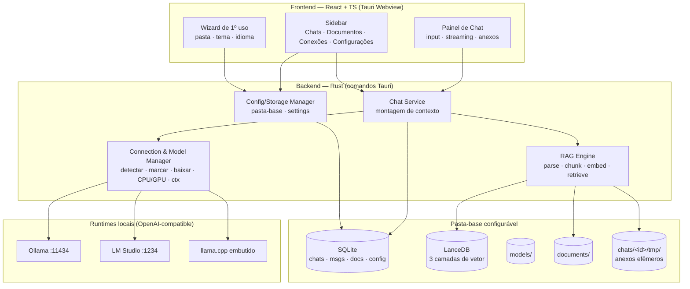

# Roadmap

**Current Milestone:** M4 — Chat: envio, streaming & anexos (M3 completo; M5 planejado, aguardando Execute)
**Status:** In Progress

---

## Arquitetura (visão geral)

**RAG em 3 camadas** (montado a cada mensagem):
1. **Global** — documentos da base de conhecimento (tabela global), buscáveis por qualquer chat.
2. **Chat/anexos** — arquivos enviados dentro do chat (namespace `chat_id`, arquivos em `tmp/` efêmeros).
3. **Conversa (memória)** — turnos da própria conversa serializados/embeddados; recuperação híbrida (últimas N verbatim + top-k antigos relevantes). Ver AD-009.

**Config inicial** por wizard de 1º uso (não no instalador — AD-010). **Storage** numa pasta-base configurável (AD-008). **i18n** EN padrão + PT; temas claro/escuro/extras (AD-007).

---

## M1 — Fundação & Shell — ✅ COMPLETE (verificado 2026-07-24)

- Scaffold Tauri 2 + React + TS + Tailwind v4 + Zustand
- Sidebar com Chats (topo), Documentos e Conexões (placeholders)
- SQLite + migrações; CRUD de chats (criar/listar/renomear/excluir) persistido
- Verificado: compila, janela abre, `localmind.db` criado

---

## M2 — Configurações, Storage & i18n — IN PROGRESS

**Goal:** Base de configuração de todo o app: pasta de armazenamento, temas e idioma, mais o wizard de 1º uso.
**Target:** 1ª abertura mostra o wizard; Configurações permite trocar tema/idioma/pasta; tudo persiste.

### Features

**Config & Storage Manager** — PLANNED

- Pasta-base configurável contendo `models/`, `documents/`, `vectors/`, `chats/<id>/tmp/`, `localmind.db`
- Persistência de settings; validação/criação da pasta; realocar `localmind.db` para a pasta escolhida

**Wizard de 1º uso** — PLANNED

- Na 1ª execução: escolher pasta de dados, tema e idioma antes de entrar no app

**Seção Configurações na sidebar** — PLANNED

- Tema: claro, escuro + temas de cor extras (CSS variables)
- Idioma: inglês (padrão) + português (i18n)
- Editar pasta de armazenamento

---

## M3 — Conexões & Modelos — ✅ COMPLETE (2026-07-25)

**Goal:** Descobrir runtimes locais, escolher quais usar, e gerenciar modelos (usar/baixar) com config de execução.
**Target:** Usuário vê conexões disponíveis, marca as ativas, vê/baixa modelos compatíveis com sua memória e ajusta contexto e CPU/GPU.

### Features

**Connection Manager** — PLANNED

- Detectar Ollama (`:11434`) e LM Studio (`:1234`); listar disponíveis; marcar quais usar (habilitar/desabilitar)
- Status/saúde por conexão; adicionar conexão manual (URL)

**Model Manager** — PLANNED

- Listar modelos instalados (para usar) e disponíveis para baixar
- Filtrar modelos para download pela memória disponível (RAM do sistema; ocultar os que não cabem)
- Baixar modelo com progresso (via API pull do Ollama)

**Config de execução** — PLANNED

- Tamanho de contexto (context window) configurável
- Escolha CPU vs GPU

---

## M4 — Chat: envio, streaming & anexos — PLANNED

**Goal:** Conversar de verdade: enviar mensagem, receber streaming e anexar arquivos como RAG do chat.
**Target:** Envio de texto + anexo → resposta em streaming usando o modelo marcado, com os anexos como contexto.

### Features

**Envio & streaming** — PLANNED

- Campo de mensagem no chat; enviar → resposta em streaming (OpenAI-compatible); cancelar
- Seleção de modelo por chat + system prompt opcional

**Anexos no chat** — PLANNED

- Enviar arquivos junto com o texto; serializar para `chats/<id>/tmp/`
- Processar → RAG do chat (namespace `chat_id`); usados junto da pergunta
- Arquivos do chat são apagados quando o chat é excluído

---

## M5 — Base de Conhecimento & RAG global — PLANNED

**Goal:** Importar documentos para a base global com feedback de processamento e usá-los como RAG.
**Target:** Importar documento → ver progresso → quando pronto, fica buscável; respostas citam trechos.

### Features

**Ingestão com progresso** — PLANNED

- Aba Documentos: botão importar (PDF, DOCX, TXT, MD)
- Barra/indicador de processamento; só arquivos **processados** entram no RAG
- Listar, ver status, remover

**Embedding & Retrieval** — PLANNED

- Embeddings (fastembed ONNX, modelo multilíngue) → LanceDB (tabela global)
- Recuperação top-k + injeção no contexto + citações; toggle por chat

---

## M6 — Memória de conversa (RAG híbrido) — PLANNED

**Goal:** Serializar a conversa e usá-la como memória via RAG híbrido, junto das outras camadas.
**Target:** Chat lembra de coisas ditas muito antes (além da janela de contexto) recuperando turnos relevantes.

### Features

**Memória de sessão** — PLANNED

- Serializar/embeddar cada turno num namespace vetorial da conversa (`chat_id`)
- Montagem de contexto híbrida: system prompt + últimas N verbatim + top-k turnos antigos + RAG global + RAG anexos
- Combinação/ordenação e orçamento de tokens entre as 3 camadas

---

## M7 — Runtime embutido (fallback) — PLANNED

**Goal:** Funcionar do zero sem Ollama/LM Studio instalados.
**Target:** Em máquina limpa, o app conversa usando o llama.cpp embutido.

### Features

**Sidecar llama.cpp** — PLANNED

- Empacotar llama.cpp como sidecar por plataforma; fallback automático
- Baixar/gerenciar um modelo padrão pequeno (com consentimento), respeitando a pasta `models/`

---

## M8 — Empacotamento & Distribuição — PLANNED

**Goal:** Gerar os instaladores finais multiplataforma.
**Target:** `.msi`/`.exe` (Windows) e `.AppImage`/`.deb` (Linux) no CI.

### Features

**Build & Instaladores** — PLANNED

- Bundler Tauri por SO (ícones, assinatura opcional)
- GitHub Actions: matrix Windows + Linux, artefatos versionados
- Auto-update (opcional); config inicial fica no wizard de 1º uso (não no instalador — AD-010)

---

## Future Considerations

- Perfis de agente reutilizáveis (persona + modelo + docs vinculados)
- Agentes com ferramentas (busca em arquivos, execução de código, web opcional)
- Página customizada no instalador NSIS Windows (pasta durante a instalação)
- Detecção de VRAM por GPU para filtragem de modelos mais precisa
- Suporte a macOS · OCR de documentos escaneados
- Export/import de chats e da base de conhecimento
