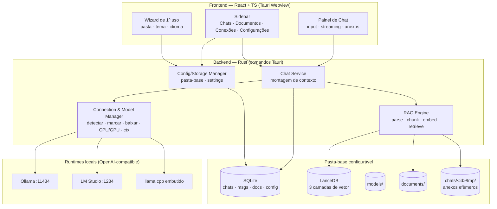

# Roadmap

**Current Milestone:** M6 — Memória de conversa (RAG híbrido). **É o único milestone sem nada feito e sem spec.**
**Status:** In Progress — M3.1, M7, M5 e M4 concluídos em 2026-07-25; **M8 implementado em 2026-07-26** (23 das 24 tasks; falta só a T24, que é publicar uma release de verdade e atualizar nos dois modos).

> **Ordem de execução revisada (2026-07-25):** o usuário puxou o M7 (runtime embutido) para antes de M4/M5, e pediu a regra de "um único ativo" (M3.1). Ordem real agora: **M3.1 → M7 → M5 → M4**.

---

## Arquitetura (visão geral)

**RAG em 3 camadas** (montado a cada mensagem):
1. **Global** — documentos da base de conhecimento (tabela global), buscáveis por qualquer chat.
2. **Chat/anexos** — arquivos enviados dentro do chat (namespace `chat_id`, arquivos em `tmp/` efêmeros).
3. **Conversa (memória)** — turnos da própria conversa serializados/embeddados; recuperação híbrida (últimas N verbatim + top-k antigos relevantes). Ver AD-009.

**Config inicial** por wizard de 1º uso (não no instalador — AD-010). **Storage** numa pasta-base configurável (AD-008). **i18n** EN padrão + PT; temas claro/escuro/extras (AD-007).

---

## M1 — Fundação & Shell — ✅ COMPLETE (verificado 2026-07-24)

- Scaffold Tauri 2 + React + TS + Tailwind v4 + Zustand
- Sidebar com Chats (topo), Documentos e Conexões (placeholders)
- SQLite + migrações; CRUD de chats (criar/listar/renomear/excluir) persistido
- Verificado: compila, janela abre, `localmind.db` criado

---

## M2 — Configurações, Storage & i18n — ✅ COMPLETE (2026-07-24)

**Goal:** Base de configuração de todo o app: pasta de armazenamento, temas e idioma, mais o wizard de 1º uso.
**Target:** 1ª abertura mostra o wizard; Configurações permite trocar tema/idioma/pasta; tudo persiste.

### Features

**Config & Storage Manager** — DONE

- Pasta-base configurável contendo `models/`, `documents/`, `vectors/`, `chats/<id>/tmp/`, `localmind.db`
- Persistência de settings; validação/criação da pasta; realocar `localmind.db` para a pasta escolhida

**Wizard de 1º uso** — DONE

- Na 1ª execução: escolher pasta de dados, tema e idioma antes de entrar no app

**Seção Configurações na sidebar** — DONE

- Tema: claro, escuro + temas de cor extras (CSS variables)
- Idioma: inglês (padrão) + português (i18n)
- Editar pasta de armazenamento

---

## M3 — Conexões & Modelos — ✅ COMPLETE (2026-07-25)

**Goal:** Descobrir runtimes locais, escolher quais usar, e gerenciar modelos (usar/baixar) com config de execução.
**Target:** Usuário vê conexões disponíveis, marca as ativas, vê/baixa modelos compatíveis com sua memória e ajusta contexto e CPU/GPU.

### Features

**Connection Manager** — DONE

- Detectar Ollama (`:11434`) e LM Studio (`:1234`); listar disponíveis; marcar quais usar (habilitar/desabilitar)
- Status/saúde por conexão; adicionar conexão manual (URL)

**Model Manager** — DONE

- Listar modelos instalados (para usar) e disponíveis para baixar
- Filtrar modelos para download pela memória disponível (RAM do sistema; ocultar os que não cabem)
- Baixar modelo com progresso (via API pull do Ollama)

**Config de execução** — DONE

- Tamanho de contexto (context window) configurável
- Escolha CPU vs GPU

---

## M3.1 — Conexão & modelo ativos únicos — ✅ COMPLETE (2026-07-25)

**Goal:** Eliminar a ambiguidade "várias conexões habilitadas, qual responde?" deixada pelo M3.
**Target:** Uma conexão ativa, um modelo ativo (sempre dela), escolhidos numa única ação.

### Features

**Par ativo único** — DONE (`.specs/features/single-active-connection/`, 10/10 tasks)

- `connections.enabled` (múltiplas) vira `is_active` (exclusiva); `toggle_connection` sai
- Escolher modelo ativa a conexão dona na mesma transação — invariante garantida no backend
- Conexões inativas seguem listadas com status e modelos inspecionáveis
- Revoga a AD-016 (modelo por chat) — ver AD-021

**Migração de schema versionada** — DONE

- `PRAGMA user_version` + lista ordenada de migrações (resolve C-01 do CONCERNS.md)
- Pré-requisito real do M7, que precisa adicionar tabela em banco já existente

---

## M7 — Runtime embutido (llama.cpp) — ✅ COMPLETE (2026-07-25)

> **Puxado para antes de M4/M5** a pedido do usuário (era o último antes do empacotamento).

**Goal:** Funcionar do zero sem Ollama/LM Studio instalados.
**Target:** Em máquina limpa, o app baixa o runtime + um modelo e conversa sozinho.

### Features

**Sidecar llama.cpp gerenciado pelo app** — DONE (`.specs/features/embedded-runtime/`, 16/16 tasks)

- Baixa o binário `llama-server` do release mais recente (Windows + Linux), com progresso
- Backend **Vulkan** (cobre NVIDIA/AMD/Intel sem toolkit); CPU como fallback — AD-022
- Detecção de GPU pelo próprio binário (`--list-devices`), sem lib pesada
- Modelo padrão: Phi-3.5 Mini Instruct Q4_K_M (MIT, ~2.4GB), escolhido pelo usuário
- Processo filho com porta livre automática, health check e kill no `RunEvent::ExitRequested`
- Aparece como mais uma conexão (`provider = "embedded"`), ativável pela mesma regra do M3.1

---

## M4 — Chat: envio, streaming & anexos — ✅ COMPLETE (2026-07-25)

**Goal:** Conversar de verdade: enviar mensagem, receber streaming e anexar arquivos como RAG do chat.
**Target:** Envio de texto + anexo → resposta em streaming usando o modelo marcado, com os anexos como contexto.

### Features

**Envio & streaming** — DONE

- Campo de mensagem no chat; enviar → resposta em streaming (OpenAI-compatible); cancelar
- Seleção de modelo por chat + system prompt opcional

**Anexos no chat** — DONE

- Enviar arquivos junto com o texto; serializar para `chats/<id>/tmp/`
- Processar → RAG do chat (namespace `chat_id`); usados junto da pergunta
- Arquivos do chat são apagados quando o chat é excluído

---

## M5 — Base de Conhecimento & RAG global — ✅ COMPLETE (2026-07-25)

**Goal:** Importar documentos para a base global com feedback de processamento e usá-los como RAG.
**Target:** Importar documento → ver progresso → quando pronto, fica buscável; respostas citam trechos.

### Features

**Ingestão com progresso** — DONE

- Aba Documentos: botão importar (PDF, DOCX, TXT, MD)
- Barra/indicador de processamento; só arquivos **processados** entram no RAG
- Listar, ver status, remover

**Embedding & Retrieval** — DONE

- Embeddings (fastembed ONNX, modelo multilíngue) → LanceDB (tabela global)
- Recuperação top-k + injeção no contexto + citações; toggle por chat

---

## M6 — Memória de conversa (RAG híbrido) — 📭 SEM SPEC, SEM CÓDIGO

> **O único milestone que ainda não existe em lugar nenhum.** Não há `.specs/features/` para ele — só a AD-009 (decisão de usar RAG híbrido) e os três bullets abaixo. Nada foi implementado.

**Goal:** Serializar a conversa e usá-la como memória via RAG híbrido, junto das outras camadas.
**Target:** Chat lembra de coisas ditas muito antes (além da janela de contexto) recuperando turnos relevantes.

### Features

**Memória de sessão** — PLANNED

- Serializar/embeddar cada turno num namespace vetorial da conversa (`chat_id`)
- Montagem de contexto híbrida: system prompt + últimas N verbatim + top-k turnos antigos + RAG global + RAG anexos
- Combinação/ordenação e orçamento de tokens entre as 3 camadas

---

## M7 — Runtime embutido — ⬆️ movido para antes do M4 (ver acima)

---

## M8 — Empacotamento & Distribuição — ⚙️ IMPLEMENTADO, NÃO PUBLICADO (2026-07-26)

> **Leia isto antes de confiar no "implementado".** Código, workflows, scripts e UI estão todos escritos, com 123 testes Rust e 27 de script verdes. O que **não** aconteceu: nenhuma release foi publicada, nenhum instalador foi gerado, nenhum update foi aplicado. O gate desta feature é a T24, e ela continua aberta.

**Goal:** Gerar os instaladores finais multiplataforma, publicá-los por disparo manual com versão semântica, e fazer o app se atualizar sozinho — inclusive sem direitos de administrador.
**Target:** Um "Run workflow" + escolher `major`/`minor`/`patch` produz versão, CHANGELOG, tag e uma release com `.msi`, `-setup.exe`, `.deb`, `.AppImage` e `.zip` portátil, todos assinados. O app instalado **e** o portátil detectam a versão nova, perguntam e se atualizam.

**Spec:** `.specs/features/release-distribution/` — `context.md` + `spec.md` (27 requisitos REL-01…REL-27) + `design.md` + `tasks.md` (24 tasks). Ver AD-034.

### Features

**Pipeline de release manual com versão semântica** — CÓDIGO PRONTO, NUNCA EXECUTADO (REL-01…REL-07, REL-25, REL-26)

- `ci.yml`: valida todo push/PR (`npm run build`, `cargo test`, Conventional Commits)
- `release.yml`: **só** `workflow_dispatch`, com select `bump`. Push em `master` nunca publica
- Uma execução faz tudo: calcula a versão da última tag, grava nos arquivos que a duplicam, gera CHANGELOG (git-cliff), commita, tagueia e publica

**Instaladores + bundle portátil** — CÓDIGO PRONTO, NENHUM ARTEFATO GERADO (REL-08…REL-12)

- Matriz `windows-latest` + `ubuntu-22.04` via `tauri-action`; release nasce draft e só é publicada com todos os artefatos no lugar
- NSIS em `installMode: currentUser` — instala em `%LOCALAPPDATA%`, **sem UAC**
- `.zip` portátil de Windows assinado com a mesma chave minisign dos instaladores
- Linux não ganha zip: o `.AppImage` já roda sem instalar e já é atualizável sem root

**Auto-update nos dois modos** — CÓDIGO PRONTO, NUNCA EXERCITADO (REL-13…REL-24)

- Modo detectado por arquivo marcador `.portable` ao lado do executável
- Portátil grava config e dados ao lado do executável (nunca `%APPDATA%`)
- Instalado → `tauri-plugin-updater` oficial; portátil → troca de arquivos in-place (rename-then-replace, com rollback), sem elevação
- Banner não bloqueante com Atualizar / Depois / Pular esta versão; Configurações ganha versão, "Verificar agora" e toggle de opt-out
- Config inicial segue no wizard de 1º uso, não no instalador (AD-010)

**Fora do escopo:** code signing (SmartScreen vai avisar), macOS, canal beta, delta updates.

---

## Future Considerations

- Perfis de agente reutilizáveis (persona + modelo + docs vinculados)
- Agentes com ferramentas (busca em arquivos, execução de código, web opcional)
- Página customizada no instalador NSIS Windows (pasta durante a instalação)
- Detecção de VRAM por GPU para filtragem de modelos mais precisa
- Suporte a macOS · OCR de documentos escaneados
- Export/import de chats e da base de conhecimento
